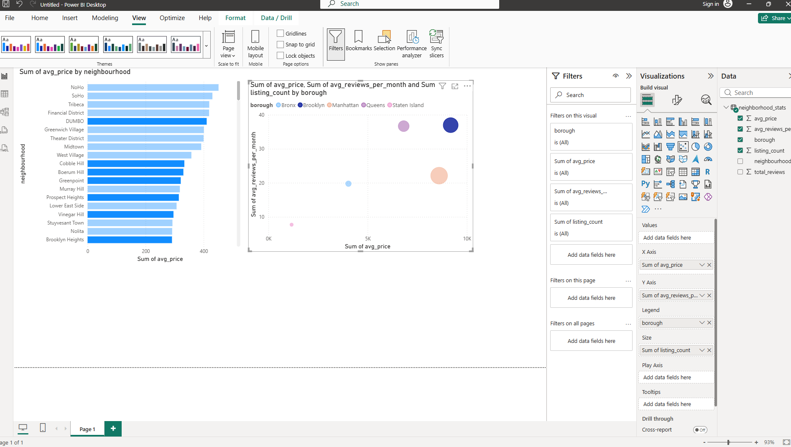

# AI-Powered Airbnb Market Insights Assistant

A data analytics project that identifies the best-value Airbnb neighbourhoods in New York City by
combining SQL/Power BI analysis with a natural-language Q&A layer powered by Google's Gemini API.

## Problem

Travelers and analysts want to know: which neighbourhoods offer the best value — decent guest
demand at a fair price — without manually digging through thousands of individual listings.

## What it does

1. Cleans and analyses ~20,000 real NYC Airbnb listings (Inside Airbnb data)
2. Aggregates price and demand metrics across 158 neighbourhoods using SQL (SQLite)
3. Calculates a custom **value score** (demand relative to price) to rank neighbourhoods
4. Visualises findings in an interactive Power BI dashboard — price vs. demand by borough, plus a
   ranked "best value" neighbourhood table
5. Lets users ask questions in plain English (e.g. *"which neighbourhood offers the best value for
   money?"*) and get answers generated by Google's Gemini API, grounded strictly in the real
   underlying data (a simple retrieval-based / RAG-style approach) rather than general AI knowledge

## Key finding

**Fort Hamilton, Brooklyn** came out on top for value — a below-average price of $211.74/night
paired with the highest demand signal in the dataset (3.01 reviews/month). Manhattan's core
neighbourhoods (SoHo, Tribeca, Financial District) are the most expensive overall, but actually show
*lower* review turnover per listing than several outer-borough areas — suggesting high supply and
longer average stays rather than higher genuine demand per listing.

## Tech stack

- **Data Analysis:** Python (Pandas), SQL (SQLite)
- **Visualisation:** Power BI (scatter analysis, ranked value tables)
- **AI Layer:** Google Gemini API (`gemini-3.1-flash-lite`), prompt engineering, basic retrieval-based grounding (RAG-style)

## Data source

[Inside Airbnb](https://insideairbnb.com/get-the-data/) — real, publicly available listing data for
New York City, licensed under Creative Commons Attribution 4.0. This project uses the summary
listings file (no star-rating field), so **reviews-per-month** is used as the demand/popularity
signal in place of a review score.

## Project structure

```
airbnb-market-insights-assistant/
├── data/
│   ├── raw/            # original CSVs (excluded from repo — download from Inside Airbnb)
│   └── processed/       # cleaned data, SQLite DB, neighbourhood stats & summaries
├── src/
│   ├── clean_data.py       # loads and cleans raw listings data
│   ├── aggregate_sql.py    # SQL aggregation into neighbourhood_stats.csv
│   ├── build_summaries.py  # builds per-neighbourhood text summaries + value score
│   └── ask_assistant.py    # Gemini-powered natural-language Q&A over the summaries
├── dashboard/
│   └── airbnb_dashboard.pbix   # Power BI dashboard
├── requirements.txt
└── README.md
```

## How to run it

1. Clone this repo
2. Download NYC listings data from [Inside Airbnb](https://insideairbnb.com/get-the-data/) and place
   `listings.csv` in `data/raw/`
3. Create a virtual environment and install dependencies:
   ```
   python -m venv venv
   venv\Scripts\activate        # Windows
   pip install -r requirements.txt
   ```
4. Add your own free [Gemini API key](https://aistudio.google.com/) to a `.env` file:
   ```
   GEMINI_API_KEY=your_key_here
   ```
5. Run the pipeline in order:
   ```
   python src/clean_data.py
   python src/aggregate_sql.py
   python src/build_summaries.py
   python src/ask_assistant.py
   ```
6. Open `dashboard/airbnb_dashboard.pbix` in Power BI Desktop to view the visual dashboard

## Sample interaction

> **Q: Which neighborhood offers the best value for money?**
> A: The Financial District offers the best value for money with the highest value score of 0.39...
> *(early version — see note below)*
>
> **Q: Which neighborhood offers the best value for money?** *(after fixing retrieval logic)*
> A: Fort Hamilton (Brooklyn) offers the best value for money with a value score of 1.42. This
> neighborhood has an average price of $211.74 and averages 3.01 reviews per month.

## Notes on building this — real issues hit and fixed

- **Missing metric:** the AI initially couldn't answer "best value" questions because the value
  score was calculated in Power BI (DAX) but never exported into the data the AI reads from. Fixed
  by recreating the same calculation in Python.
- **Biased retrieval:** general questions with no neighbourhood named initially defaulted to a small,
  price-sorted slice of the data (the 5 most expensive areas) instead of searching the full dataset —
  producing a plausible but incorrect answer. Fixed by falling back to the full 158-row dataset for
  general comparison questions.
- **Deprecated SDK/model:** built using `google-generativeai` and `gemini-2.5-flash`, both since
  deprecated by Google. Migrated to the current `google-genai` SDK and `gemini-3.1-flash-lite` model
  mid-project.

## Dashboard preview



*(Add your dashboard screenshot as `dashboard/dashboard_preview.png`, or replace this line with your
actual screenshot path.)*
